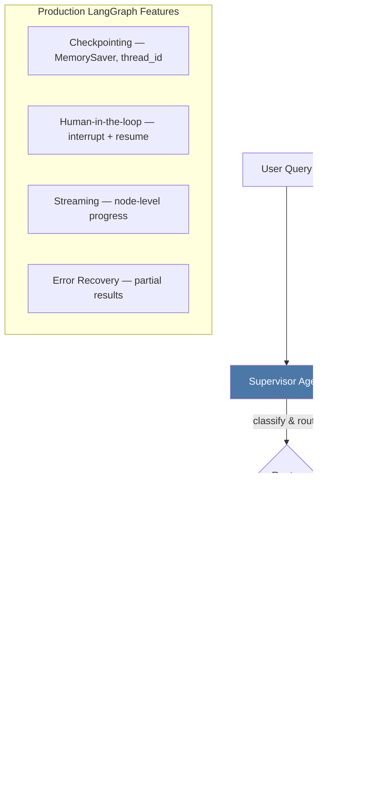
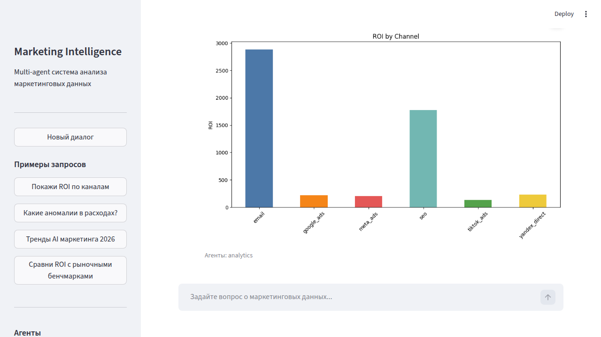
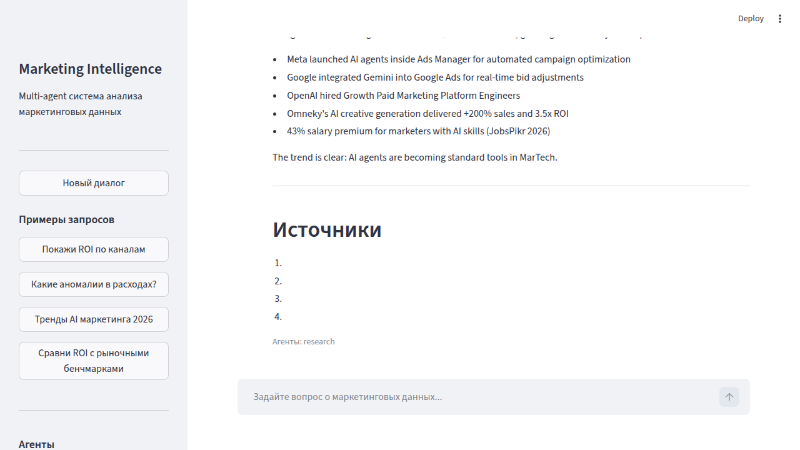
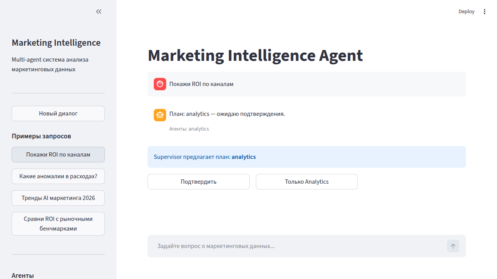

# Marketing Intelligence Agent

Multi-agent marketing analytics system powered by **LangGraph**. Ask questions in natural language — get data-driven reports with charts, metrics, and market research.

> Reduces manual marketing analysis from **2+ hours to 30 seconds**. 68 tests, 100% routing accuracy on eval suite.

## Architecture



### LangGraph Graph Flow

```
START → supervisor → [interrupt_before if HITL] → route_agents
    ├── analytics (CSV loader, metrics, charts)
    ├── research (Tavily search, web scraper)
    └── both (sequential)
→ synthesize → END
```

**Key LangGraph patterns demonstrated:**
- `StateGraph` with `TypedDict` + `Annotated` reducers
- Conditional edges with dynamic routing
- `MemorySaver` checkpointing with `thread_id` isolation
- `interrupt_before` for human-in-the-loop approval
- `stream_mode="updates"` for node-level streaming
- Error recovery with partial results (no crash on agent failure)

## Quick Start

```bash
# 1. Clone & install
git clone https://github.com/yourusername/marketing-intelligence-agent.git
cd marketing-intelligence-agent
python3 -m venv .venv && source .venv/bin/activate
pip install -e ".[dev]"

# 2. (Optional) Add API keys for real LLM/search
cp .env.example .env
# Edit .env with OPENAI_API_KEY, TAVILY_API_KEY

# 3. Run
streamlit run src/ui/app.py
```

Works without API keys using built-in demo data and mock responses.

### Docker

```bash
docker compose up
# Open http://localhost:8501
```

## Screenshots

| Analytics Query | Research Query | Human-in-the-loop |
|:-:|:-:|:-:|
|  |  |  |

## Features

### Agents
| Agent | Role | Tools |
|-------|------|-------|
| **Supervisor** | Classifies queries, routes to agents | Keyword + LLM classification |
| **Analytics** | Campaign data analysis | CSV loader, pandas metrics, matplotlib charts |
| **Research** | Market intelligence | Tavily search, BeautifulSoup scraper |
| **Report** | Combines outputs | Markdown formatter with error handling |

### Production LangGraph Features
| Feature | What it demonstrates |
|---------|---------------------|
| **Checkpointing** | `MemorySaver` + `thread_id` — state persists across invocations |
| **Human-in-the-loop** | `interrupt_before` — supervisor proposes plan, user approves/modifies |
| **Streaming** | `stream_mode="updates"` — real-time node progress in UI |
| **Error Recovery** | Agent failures produce partial results, not crashes |

### Evaluation Pipeline
- 12 ground truth questions with expected agents, keywords, and facts
- Routing accuracy: **100%**
- Content presence: **100%**
- Factual accuracy: **100%**
- Optional LLM-as-judge scoring (with API key)

```bash
python -m src.evaluation.evaluator
```

## Tech Stack

| Component | Technology |
|-----------|------------|
| Orchestration | LangGraph (StateGraph, checkpointing, HITL, streaming) |
| LLM | OpenAI GPT-4o-mini (via LangChain) — works without key via fallbacks |
| Web Search | Tavily (with mock fallback) |
| Data Analysis | pandas + matplotlib |
| Web Scraping | BeautifulSoup4 |
| UI | Streamlit |
| Testing | pytest (68 tests) |
| Linting | ruff |

## Project Structure

```
├── src/
│   ├── state.py              # TypedDict state schema
│   ├── graph.py              # LangGraph workflow (checkpointing, HITL, streaming)
│   ├── agents/
│   │   ├── supervisor.py     # Query classification + routing
│   │   ├── analytics.py      # Campaign data analysis
│   │   ├── research.py       # Web search + scraping
│   │   └── report.py         # Markdown report builder
│   ├── tools/
│   │   ├── data_loader.py    # CSV loader, metrics, anomaly detection
│   │   ├── charts.py         # bar/line/pie → base64 PNG
│   │   ├── search.py         # Tavily + mock fallback
│   │   └── scraper.py        # BeautifulSoup + mock
│   ├── evaluation/
│   │   └── evaluator.py      # Routing/content/fact scoring + LLM judge
│   └── ui/
│       └── app.py            # Streamlit (streaming, HITL, chat)
├── data/
│   ├── demo_campaigns.csv    # 72 rows, 6 channels, 12 months
│   └── eval_questions.json   # 12 ground truth questions
├── tests/                    # 68 tests
├── Dockerfile
├── docker-compose.yml
└── pyproject.toml
```

## Running Tests

```bash
pip install -e ".[dev]"
pytest tests/ -v
```

## License

MIT
