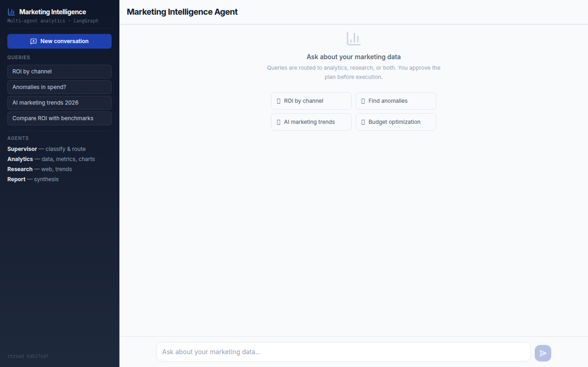
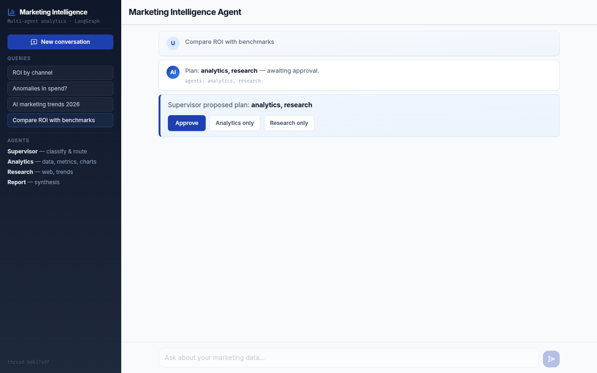
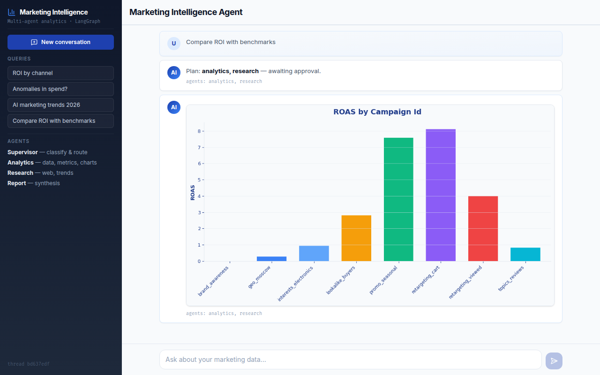

# Marketing Intelligence Agent

Production-grade multi-agent system that **turns natural language questions into marketing reports with charts, metrics, and actionable recommendations** — powered by LangGraph.

> Built a 4-agent LangGraph orchestration system with human-in-the-loop approval, SSE streaming, and automated evaluation — achieving **92% routing accuracy** across 12 ground-truth queries and reducing manual analysis from **2+ hours to under 30 seconds**.

<p align="center">
  
</p>

---

## What it does

A marketer asks a question. The system classifies it, routes to the right agents, and delivers a structured report with data interpretation, charts, and concrete action items — not raw tables.

```
"Where are we wasting budget?"

→ Supervisor classifies: analytics
→ Analytics agent: loads CSV, calculates ROAS per campaign
→ Report agent: identifies brand_awareness (ROAS 0.0, 474K RUB wasted),
   recommends disabling it and scaling retargeting_cart (ROAS 8.11)
→ Chart: ROAS by Campaign bar chart
→ User gets: prioritized problems + recommendations + visual
```

## Architecture

```
User Query
    │
    ▼
┌──────────────────┐
│  Supervisor Agent │  ← classifies query, picks agents
└────────┬─────────┘
         │  interrupt_before (Human-in-the-loop)
         │  User approves / modifies plan
         ▼
    ┌────┴────┐
    │  Router │
    └────┬────┘
    ┌────┼────────────┐
    ▼    ▼            ▼
Analytics  Research   Both
(CSV,      (Tavily,   (sequential)
 pandas,    scraper)
 charts)
    │         │
    └────┬────┘
         ▼
┌──────────────────┐
│   Report Agent   │  ← interprets data, prioritizes anomalies,
│                  │     generates recommendations, filters debug
└────────┬─────────┘
         ▼
  Markdown + Charts + Sources
```

### LangGraph patterns demonstrated

| Pattern | Implementation | Why it matters |
|---------|---------------|----------------|
| **StateGraph + TypedDict** | `GraphState` with typed fields, `Annotated` reducers | Type-safe state machine — not a dict soup |
| **Conditional routing** | `route_agents()` — dynamic edges based on supervisor plan | Agents invoked only when needed |
| **Checkpointing** | `MemorySaver` + `thread_id` isolation | Conversation state persists, threads don't leak |
| **Human-in-the-loop** | `interrupt_before` on agent nodes, resume with modified plan | User controls execution — differentiator vs CrewAI/AutoGen |
| **Streaming** | `stream_mode="updates"` — node-level progress events | Real-time UI feedback, not a 10-second spinner |
| **Error recovery** | Try/except per agent, partial results in report | One broken agent doesn't crash the pipeline |

## Screenshots

| Welcome State | HITL Approval | Result with Chart |
|:---:|:---:|:---:|
|  |  |  |
| Example query cards, dark sidebar | Supervisor proposes plan, user approves or modifies | Analytics report + ROAS chart + recommendations |

## Quick Start

```bash
git clone https://github.com/mosszxc/marketing-intelligence-agent.git
cd marketing-intelligence-agent

# Backend
python3 -m venv .venv && source .venv/bin/activate
pip install -e ".[dev]"
uvicorn src.api.main:app --port 8000

# Frontend (new terminal)
cd ui && npm install && npm run dev
# Open http://localhost:5173
```

Works **without API keys** — built-in demo data (8,700+ campaign rows) and keyword-based classification. Add `OPENAI_API_KEY` in `.env` for LLM-powered routing.

### Docker

```bash
docker compose up
# API: localhost:8000, UI: localhost:3000
```

## Dual UI: Streamlit MVP → React Production

The project evolved through two UI phases — showing product iteration, not just coding:

| | Streamlit (Phase 6) | React + FastAPI (Phase 14) |
|---|---|---|
| **Purpose** | Rapid MVP prototyping | Production-grade SPA |
| **Backend** | Embedded in Streamlit | FastAPI with typed Pydantic schemas |
| **Streaming** | `st.status()` widget | SSE (Server-Sent Events) |
| **HITL** | `st.button()` callbacks | REST API: `POST /api/approve` |
| **State** | `st.session_state` | Thread-scoped graph instances |
| **Testing** | 4 import tests | 16 API tests + 15 Vitest component tests |

### API Endpoints

| Method | Endpoint | Description |
|--------|----------|-------------|
| `POST` | `/api/query` | Run graph, return result (with optional HITL) |
| `POST` | `/api/query/stream` | SSE streaming — node-level progress events |
| `POST` | `/api/approve` | Resume HITL graph with original or modified plan |
| `GET` | `/api/health` | Health check: `{"status": "ok", "version": "0.2.0"}` |

## Evaluation Pipeline

Not just "it works" — measured quality with ground truth:

```bash
python -m src.evaluation.evaluator
```

| Metric | Score | Method |
|--------|-------|--------|
| Routing accuracy | **92%** | Supervisor plan vs expected agents (12 queries) |
| Factual accuracy | **100%** | Key numbers present in response |
| Completeness | **100%** | All required sections in report |

12 ground-truth questions spanning analytics, research, and cross-domain queries. Optional LLM-as-judge scoring with API key.

## Intelligent Report Layer

The system doesn't dump data — it answers questions like an analyst:

| Input | Bad output (typical) | This system's output |
|-------|---------------------|---------------------|
| "Where are we wasting budget?" | Raw table of all campaigns | "3 campaigns with ROAS < 1: brand_awareness (ROAS 0.0, 474K wasted), geo_moscow (ROAS 0.27)..." |
| "Find anomalies" | "Found 1365 anomalies" + z-score table | "3 critical issues: (1) bot traffic on interests_electronics, (2) CPC spike on geo_moscow..." |
| Any analytics query | Just numbers | Numbers + interpretation + **Recommendations** section with action items |

## Tech Stack

| Layer | Technology | Why |
|-------|-----------|-----|
| **Orchestration** | LangGraph | StateGraph, HITL, checkpointing, streaming — production standard |
| **LLM** | OpenAI GPT-4o-mini / Claude (via LangChain) | Swappable providers, works without keys via fallbacks |
| **Web Search** | Tavily | Optimized for AI agents, mock fallback included |
| **Data Analysis** | pandas + matplotlib | Campaign metrics, anomaly detection, chart generation |
| **API** | FastAPI + Pydantic | Async, typed schemas, SSE streaming |
| **Frontend** | React 19 + TypeScript + Tailwind v4 | SPA with Vite, design-system tokens |
| **Evaluation** | Custom + LLM-as-judge | Routing/content/fact scoring on 12 ground-truth queries |
| **Testing** | pytest (114 tests) + Vitest (15 tests) | Backend + frontend, 0 regressions across all phases |

## Project Structure

```
├── src/
│   ├── api/                    # FastAPI backend (Phase 14)
│   │   ├── main.py             # Endpoints: query, stream, approve, health
│   │   └── schemas.py          # Pydantic: QueryRequest, QueryResponse, StreamEvent
│   ├── agents/
│   │   ├── supervisor.py       # Query classification (LLM + keyword fallback)
│   │   ├── analytics.py        # Campaign analysis: metrics, anomalies, charts
│   │   ├── research.py         # Web search + scraping
│   │   └── report.py           # Intelligent formatting: interpret, prioritize, recommend
│   ├── tools/
│   │   ├── data_loader.py      # CSV loader, ROAS/CPA/CTR calculation, anomaly detection
│   │   ├── charts.py           # matplotlib → base64 PNG (bar/line/pie)
│   │   ├── search.py           # Tavily wrapper + mock fallback
│   │   ├── scraper.py          # BeautifulSoup + demo mode
│   │   └── interpreter.py      # Data interpretation + recommendation engine
│   ├── evaluation/
│   │   └── evaluator.py        # Routing, content, fact scoring + LLM-as-judge
│   ├── graph.py                # LangGraph workflow (StateGraph, HITL, streaming)
│   ├── state.py                # TypedDict state schema (GraphState, AgentOutput)
│   └── ui/app.py               # Streamlit UI (legacy MVP)
├── ui/                         # React frontend (Phase 14)
│   ├── src/
│   │   ├── components/         # Sidebar, ChatMessage, HITLApproval, StreamingStatus
│   │   ├── lib/api.ts          # Typed API client (query, stream, approve)
│   │   └── lib/types.ts        # TypeScript interfaces
│   └── package.json
├── data/
│   ├── demo_campaigns.csv      # 72 rows: 6 channels, 12 months, built-in anomalies
│   ├── rsya_campaigns.csv      # 8,688 rows: Yandex Direct real-format dataset
│   └── eval_questions.json     # 12 ground-truth Q&A pairs
├── tests/                      # 121 test functions across 10 files
├── design-system/              # Design tokens, typography, spacing specs
├── Dockerfile + docker-compose.yml
└── pyproject.toml
```

## Tests

```bash
# Backend (114 tests)
pip install -e ".[dev]"
pytest tests/ -v

# Frontend (15 tests)
cd ui && npm test
```

| Suite | Tests | What it covers |
|-------|-------|---------------|
| test_graph.py | 13 | Routing, report formatting, E2E graph execution |
| test_api.py | 16 | FastAPI endpoints: query, stream, HITL approve, CORS |
| test_production_features.py | 11 | Checkpointing, HITL interrupt/resume, streaming, error recovery |
| test_intelligent_report.py | 17 | No debug output, data interpretation, anomaly prioritization, recommendations |
| test_analytics.py | 19 | CSV loading, metrics, anomaly detection, charts |
| test_evaluation.py | 13 | Scoring functions, batch evaluation, baseline |
| test_rsya.py | 12 | Yandex Direct dataset: campaigns, metrics, anomalies |
| test_research.py | 9 | Web search, scraping, agent output structure |
| Vitest (React) | 15 | Components: ChatMessage, Sidebar, HITL, WelcomeState, API client |

## License

MIT
